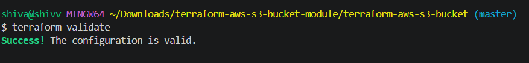

# Terraform AWS S3 Bucket Module

A reusable Terraform module for creating a secure, versioned Amazon S3 bucket with server-side encryption, lifecycle management, public-access protection, and an optional bucket policy.

<p align="center">
  
</p>


## Features

- Terraform module structure with `variables.tf`, `outputs.tf`, and `main.tf`
- S3 bucket versioning enabled by default
- Server-side encryption with SSE-S3 (`AES256`) by default, with optional KMS support
- Public access block enabled by default
- Configurable lifecycle rules
- Optional bucket policy
- `terraform fmt` and `terraform validate` workflow
- Pre-commit configuration for Terraform formatting/validation

## Module structure

```text
terraform-aws-s3-bucket/
├── .github/
│   └── workflows/
│       └── terraform.yml
├── .gitignore
├── .pre-commit-config.yaml
├── LICENSE
├── README.md
├── main.tf
├── outputs.tf
├── variables.tf
├── versions.tf
└── examples/
    └── complete/
        ├── main.tf
        ├── outputs.tf
        └── variables.tf
```

## Usage

```hcl
module "logs_bucket" {
  source = "./"

  bucket_name = "my-company-app-logs-123456"

  tags = {
    Environment = "dev"
    ManagedBy   = "terraform"
  }

  lifecycle_rules = [
    {
      id                                  = "archive-old-objects"
      enabled                             = true
      expiration_days                     = 365
      noncurrent_version_expiration_days  = 90
      transitions = [
        {
          days          = 30
          storage_class = "STANDARD_IA"
        },
        {
          days          = 90
          storage_class = "GLACIER"
        }
      ]
    }
  ]

```


### Optional KMS encryption

```hcl
module "encrypted_bucket" {
  source = "./"

  bucket_name       = "my-company-secure-data-123456"
  kms_key_id        = "arn:aws:kms:ap-south-1:123456789012:key/xxxxxxxx-xxxx-xxxx-xxxx-xxxxxxxxxxxx"
  bucket_key_enabled = true
}
```

### Optional bucket policy

Pass a JSON policy string:

```hcl
module "policy_bucket" {
  source = "./"

  bucket_name = "my-company-policy-bucket-123456"

  bucket_policy = jsonencode({
    Version = "2012-10-17"
    Statement = [{
      Sid       = "AllowTLSOnly"
      Effect    = "Deny"
      Principal = "*"
      Action    = "s3:*"
      Resource = [
        "arn:aws:s3:::my-company-policy-bucket-123456",
        "arn:aws:s3:::my-company-policy-bucket-123456/*"
      ]
      Condition = {
        Bool = {
          "aws:SecureTransport" = "false"
        }
      }
    }]
  })
}
```
### Using a released module version

For stable and reproducible deployments, consumers should pin the module
to a specific Git tag.

```hcl
module "logs_bucket" {
  source = "git::https://github.com/shivamani3286-cloud/Terraform-module-for-deploying-an-S3-bucket.git?ref=v1.0.0"

  bucket_name = "bucket-name"

  tags = {
    Environment = "dev"
    ManagedBy   = "terraform"
  }
}

## Inputs

| Name | Type | Default | Description |
|---|---|---:|---|
| `bucket_name` | `string` | n/a | Globally unique S3 bucket name. |
| `force_destroy` | `bool` | `false` | Allow Terraform to delete a non-empty bucket. |
| `versioning_enabled` | `bool` | `true` | Enable S3 bucket versioning. |
| `kms_key_id` | `string` | `null` | Optional KMS key ARN/ID. Null uses SSE-S3. |
| `bucket_key_enabled` | `bool` | `true` | Enable S3 Bucket Keys when using KMS. |
| `public_access_block` | `object` | all true | S3 public-access block settings. |
| `lifecycle_rules` | `list(object)` | `[]` | Lifecycle rules for object expiration, transitions, and noncurrent versions. |
| `bucket_policy` | `string` | `null` | Optional JSON bucket policy. |
| `tags` | `map(string)` | `{}` | Tags applied to the bucket. |

## Outputs

- `bucket_id`
- `bucket_arn`
- `bucket_name`
- `bucket_domain_name`
- `bucket_regional_domain_name`
- `bucket_region`

## Validation

Format Terraform:

```bash
terraform fmt -recursive
```

Initialize and validate:

```bash
terraform init
terraform validate
```

Run pre-commit:

```bash
pre-commit install
pre-commit run --all-files
```

The included GitHub Actions workflow also runs `terraform fmt -check` and `terraform validate`.

## Best-practice notes

- Versioning is enabled by default.
- S3 public access is blocked by default.
- Encryption is always configured; SSE-S3 is the default and KMS can be selected.
- `force_destroy` defaults to `false` to reduce accidental data loss.
- Lifecycle rules are explicit and opt-in.
- The module does not create public-read ACLs.
- Provider configuration is intentionally left to the calling root module.
- Bucket policies are optional so consumers retain control over access requirements.
